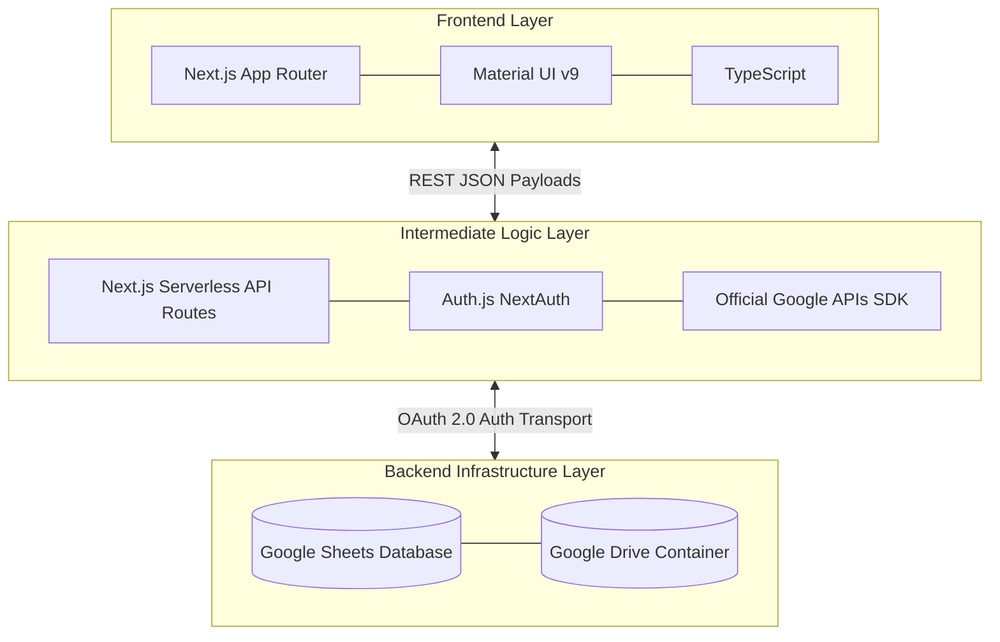

# [Gasket Case](https://github.com/danvanbueren/gasket-case) &middot; [](https://github.com/danvanbueren/gasket-case/blob/main/LICENSE.md) [](https://github.com/danvanbueren/gasket-case) [](https://github.com/danvanbueren/gasket-case/issues) [](https://github.com/danvanbueren/gasket-case/commits/main/)

A privacy-first, decentralized automotive maintenance lifecycle logging and forecasting application.

## Product Vision & Architecture

**Gasket Case** operates exclusively as a front-end interface with a **zero-storage backend**, instead utilizing client-owned storage. The application maintains no central database. Instead, it wraps a responsive Material UI timeline atop structured data stored inside Google Sheets spreadsheets in the user's own Google Drive. This ensures absolute data custody—you own, house, and control your raw records at all times.



## Features

-  **Chronological History**: An interactive vertical timeline displaying historical maintenance records alongside dynamically calculated future predictions.
-  **Prediction Engine**: Calculates daily odometer velocity ($\Delta V$) based on your real mileage accumulation to forecast a timeline for upcoming maintenance intervals.
-  **Data Custody**: Uses scoped authorization (`drive.file` and `spreadsheets`) so the platform only sees files relating to Gasket Case.
-  **Google Workspace Security Sharing**: Programmatically or manually share your vehicle spreadsheets with other users using Google Drive's native sharing permissions.
-  **Zero-Friction Guest Demo Mode**: Get a feel for the application using a browser `localStorage` sandbox without authorizing with Google.

## Algorithmic Prediction Math

1.  **Daily Odometer Velocity ($\Delta V$)**:

$$\Delta V = \frac{O_{\text{latest}} - O_{\text{earliest}}}{D_{\text{latest}} - D_{\text{earliest}}}$$

- Falls back to a default velocity of `32.87` miles/day (~12k miles/year) if data is scarce.

2.  **Milestone Date Estimation ($D_{\text{target}}$)**:

$$D_{\text{target}} = D_{\text{last\\_service}} + \frac{\Delta M}{\Delta V}$$

- where $\Delta M$ is the maintenance threshold interval (e.g., 5,000 miles for oil changes).

---

## Getting Started

### 1. Configure Local Environment

Inside the `gasket-case` subfolder, create a `.env.local` configuration file:

```env
GOOGLE_CLIENT_ID="your-google-client-id"
GOOGLE_CLIENT_SECRET="your-google-client-secret"
NEXTAUTH_SECRET="your-nextauth-secret-string-at-least-32-chars"
NEXTAUTH_URL="http://localhost:3000"
```

*Note: Google OAuth credentials require configuring `http://localhost:3000/api/auth/callback/google` as an authorized redirect URI.*

### 2. Install & Launch

Run the following commands in the application directory:

```bash
cd  gasket-case
bun  install
bun  run  dev
```

Open [http://localhost:3000](http://localhost:3000) to view the application.
