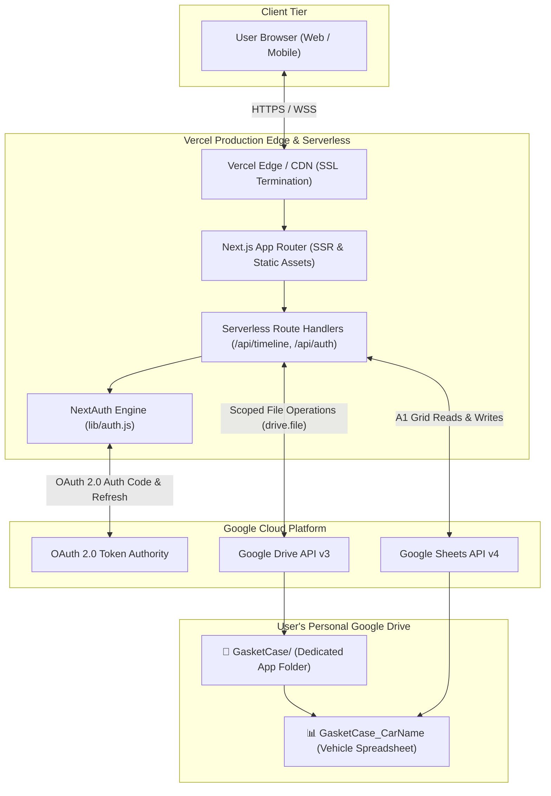

# Gasket Case &mdash; DevOps & Deployment Guide

A start-to-finish operational guide for provisioning, deploying, and maintaining **Gasket Case** across **Google Cloud Platform (GCP)** and **Vercel**.

---

## 1. Architecture & Platform Overview

Gasket Case uses a **zero-backend database** architecture. Rather than running a traditional persistent database (e.g. PostgreSQL, MongoDB), the application stores all user data in client-owned Google Sheets spreadsheets located in the user's private Google Drive.



For this pipeline to operate smoothly, **three systems must cooperate with exact configuration alignment**:
1. **Google Cloud Console**: Manages OAuth 2.0 client IDs, scopes, test users, and API enablement.
2. **Vercel**: Hosts the Next.js frontend and serverless API functions, handles domain routing, and manages production environment variables.
3. **Domain & DNS Provider**: Provisions SSL certificates and routes traffic to Vercel's edge network.

---

## 2. Google Cloud Platform (GCP) Console Setup

### Step 1: Create or Select a GCP Project
1. Navigate to the [Google Cloud Console](https://console.cloud.google.com/).
2. Click the project dropdown in the top navigation bar and select **New Project**.
3. Name your project (e.g., `Gasket-Case-Production`) and select your organization or leave as **No organization**.
4. Click **Create** and ensure your newly created project is selected in the top bar.

---

### Step 2: Enable the Required Google APIs
By default, new GCP projects have all Google Workspace APIs disabled. If you do not enable both APIs below, your API routes will fail with HTTP 403 `accessNotConfigured` or `API has not been used in project`:

1. Go to **APIs & Services > Library** from the left navigation menu.
2. Search for **Google Drive API**, select it, and click **Enable**.
3. Return to the Library, search for **Google Sheets API**, select it, and click **Enable**.

> [!IMPORTANT]
> Both the **Google Drive API** AND the **Google Sheets API** must be enabled. The application uses the Drive API for folder management and file discovery, and the Sheets API for atomic row reads, updates, and spreadsheet initialization.

---

### Step 3: Configure the OAuth Consent Screen
1. Go to **APIs & Services > OAuth consent screen**.
2. Select **External** user type (allows any user with a Google account to log in) and click **Create**.
3. **App Information**:
   - **App name**: `Gasket Case`
   - **User support email**: Select your developer email.
   - **App logo**: Optional (can be added later if undergoing public verification).
4. **App Domain**:
   - **Application home page**: `https://gasketcase.app` (or your Vercel URL)
   - **Application privacy policy link**: `https://gasketcase.app/privacy`
   - **Application terms of service link**: `https://gasketcase.app/terms`
   - **Authorized domains**: Add `gasketcase.app` and `vercel.app`.
5. **Developer Contact Information**: Enter your contact email and click **Save and Continue**.

#### Scopes Configuration (Least-Privilege Security)
On the **Scopes** page, click **Add or Remove Scopes**:
* **Standard scopes**:
  - `.../auth/userinfo.email`
  - `.../auth/userinfo.profile`
  - `openid`
* **Google Drive scope**:
  - `https://www.googleapis.com/auth/drive.file`

> [!WARNING]
> **DO NOT add `.../auth/spreadsheets` or `.../auth/drive`!**
> Adding the broad `auth/spreadsheets` scope triggers Google Cloud's sensitive data warning that your application requests access to **ALL** private spreadsheets in the user's account.
> By strictly requesting `https://www.googleapis.com/auth/drive.file`, Gasket Case can only access files that it creates or that the user explicitly opens with the app. The Sheets API fully works on app-created files under this restricted scope.

Click **Save and Continue**.

#### Test Users (While in "Testing" Status)
* While the app's Publishing Status is set to **Testing**, Google restricts authentication exclusively to approved accounts.
* Under **Test users**, click **Add Users** and enter every Google email account that will log into the app during development or staging.
* Click **Save and Continue**.

---

### Step 4: Generate OAuth 2.0 Credentials
1. Go to **APIs & Services > Credentials**.
2. Click **Create Credentials** at the top and select **OAuth client ID**.
3. In the **Application type** dropdown, select **Web application**.
4. Name the client (e.g., `Gasket Case Web Client`).
5. **Authorized JavaScript Origins**:
   Add every domain from which the browser will initiate authentication:
   - `http://localhost:3000` (Local development)
   - `https://gasketcase.app` (Production custom domain)
   - `https://www.gasketcase.app`
   - `https://<your-project-name>.vercel.app` (Vercel deployment domain)
6. **Authorized Redirect URIs**:
   Add the exact callback paths handled by NextAuth:
   - `http://localhost:3000/api/auth/callback/google`
   - `https://gasketcase.app/api/auth/callback/google`
   - `https://www.gasketcase.app/api/auth/callback/google`
   - `https://<your-project-name>.vercel.app/api/auth/callback/google`
7. Click **Create**.
8. A modal will appear displaying your **Client ID** and **Client Secret**. Copy both values immediately.

---

## 3. Vercel Deployment & Project Configuration

### Step 1: Link the GitHub Repository to Vercel
1. Log in to [Vercel](https://vercel.com/) and click **Add New... > Project**.
2. Import your GitHub repository (`danvanbueren/gasket-case`).
3. **Configure Project Settings**:
   - **Root Directory**:
     > [!IMPORTANT]
     > The Next.js project is located in the `gasket-case/` subdirectory of the repository.
     > Click **Edit** next to **Root Directory** and select `gasket-case`.
   - **Framework Preset**: Ensure `Next.js` is selected.
   - **Build Command**: Leave default (`next build`) or `bun run build`.
   - **Output Directory**: Leave default (`.next`).

---

### Step 2: Configure Environment Variables in Vercel
Under the **Environment Variables** section in the Vercel project setup (or under **Project Settings > Environment Variables**), add the following:

| Variable Name | Environment(s) | Example / Format | Purpose |
| :--- | :--- | :--- | :--- |
| `GOOGLE_CLIENT_ID` | Production, Preview, Development | `xxxxxxxx.apps.googleusercontent.com` | OAuth 2.0 Client ID from GCP |
| `GOOGLE_CLIENT_SECRET` | Production, Preview, Development | `GOCSPX-xxxxxxxxxxxxxxxxx` | OAuth 2.0 Client Secret from GCP |
| `NEXTAUTH_SECRET` | Production, Preview, Development | `dK9... (32-byte base64 string)` | Used by NextAuth to encrypt JWTs |
| `NEXTAUTH_URL` | Production | `https://gasketcase.app` | Base URL used to construct the OAuth callback URI |

#### How to Generate `NEXTAUTH_SECRET`
Run this command in any terminal:
```bash
openssl rand -base64 32
```
Copy the output string directly into the Vercel environment variable value.

> [!NOTE]
> For preview deployments on Vercel (`*.vercel.app`), NextAuth automatically detects `VERCEL_URL` if `NEXTAUTH_URL` is omitted in Preview environments. For the **Production** environment, `NEXTAUTH_URL` should be explicitly set to your canonical domain (e.g. `https://gasketcase.app`).

---

### Step 3: Custom Domain & DNS Setup
1. In Vercel, navigate to **Project Settings > Domains**.
2. Enter your apex domain: `gasketcase.app` and click **Add**.
3. Select the recommended configuration:
   - Redirect `gasketcase.app` to `www.gasketcase.app` (or vice-versa depending on your preference).
4. In your DNS provider (e.g., Namecheap, Cloudflare, Google Domains):
   - **Apex Record**: Type `A`, Name `@`, Value `76.76.21.21`
   - **WWW Record**: Type `CNAME`, Name `www`, Value `cname.vercel-dns.com`
5. Once DNS propagates, Vercel will automatically issue and renew a free Let's Encrypt SSL/TLS certificate.

---

### Step 4: Trigger Deployment
* If you added or updated environment variables after your initial deployment, you must trigger a rebuild for the new variables to be injected into the serverless runtime:
  - Go to the **Deployments** tab in Vercel.
  - Click the three dots (`...`) on the latest deployment and select **Redeploy**.

---

## 4. Making GCP and Vercel Cooperate (End-to-End Handshake)

### The Complete Authentication & Lifecycle Flow

```
1. Browser requests login:
   User clicks "Sign in with Google" at https://gasketcase.app
   │
2. NextAuth initiates handshake:
   NextAuth redirects to https://accounts.google.com/o/oauth2/v2/auth
   with:
   - client_id = GOOGLE_CLIENT_ID
   - redirect_uri = https://gasketcase.app/api/auth/callback/google
   - scope = drive.file openid email profile
   - access_type = offline, prompt = consent
   │
3. Google verifies redirect URI:
   Google checks if "https://gasketcase.app/api/auth/callback/google" matches
   an entry in the GCP Console "Authorized redirect URIs".
   │
4. User grants consent:
   User sees "Gasket Case wants to create and manage its own files in Google Drive".
   │
5. Google returns authorization code:
   Browser is redirected to https://gasketcase.app/api/auth/callback/google?code=...
   │
6. NextAuth exchanges code for tokens:
   Vercel Serverless Function makes a POST request to https://oauth2.googleapis.com/token
   Receives:
   - access_token (valid for 3600 seconds)
   - refresh_token (long-lived)
   │
7. Dedicated Folder & Sheets Sync:
   App checks for an existing "GasketCase" folder in Google Drive root.
   - If absent: creates the folder via drive.files.create.
   - Any root GasketCase spreadsheets are automatically organized into it.
   - Vehicle spreadsheets are queried and rendered on the timeline.
```

---

## 5. Troubleshooting & Gotchas

### Issue 1: `Error 400: redirect_uri_mismatch`
* **Symptom**: After clicking "Sign in with Google", Google displays a 400 error stating `redirect_uri_mismatch`.
* **Root Causes**:
  1. **Protocol Mismatch (`http` vs `https`)**: NextAuth is constructing `http://gasketcase.app/...` instead of `https://gasketcase.app/...`.
     - *Fix*: In `gasket-case/lib/auth.js`, ensure `useSecureCookies: true` or verify that `NEXTAUTH_URL` starts with `https://`.
  2. **Missing URI in GCP**: The redirect URI requested by the browser is not in the GCP Console Authorized Redirect URIs list.
     - *Fix*: Inspect the "Request details" link on the Google error page. Copy the exact `redirect_uri` string shown and paste it into GCP Console **APIs & Services > Credentials > Authorized redirect URIs**.
  3. **Trailing Slashes**: `https://gasketcase.app/api/auth/callback/google/` (with a trailing slash) does **not** match `https://gasketcase.app/api/auth/callback/google`. Do not include trailing slashes.

---

### Issue 2: `Error 403: accessNotConfigured` or `API has not been used`
* **Symptom**: Sign-in succeeds, but vehicle creation or timeline fetching fails with an API error.
* **Root Cause**: The **Google Drive API** or **Google Sheets API** is not enabled in your GCP project.
* **Fix**:
  - Visit `https://console.cloud.google.com/apis/library/drive.googleapis.com` and click **Enable**.
  - Visit `https://console.cloud.google.com/apis/library/sheets.googleapis.com` and click **Enable**.

---

### Issue 3: `Access blocked: This app has not been verified`
* **Symptom**: User cannot sign in, and Google blocks access.
* **Root Cause**: The GCP OAuth Consent Screen is in **Testing** publishing status, and the user's email address has not been added to the **Test users** list.
* **Fix**: Go to GCP Console **APIs & Services > OAuth consent screen > Test users**, add the email address, and click **Save**.

---

### Issue 4: NextAuth Session Expires After 1 Hour
* **Symptom**: The user is signed out or timeline operations fail with 401 Unauthorized after 60 minutes.
* **Root Cause**: Google OAuth access tokens expire after 3,600 seconds. Without token refresh rotation, the session token becomes invalid.
* **Fix**: Gasket Case implements silent offline refresh token rotation in `lib/auth.js`. Verify that your `GOOGLE_CLIENT_ID` and `GOOGLE_CLIENT_SECRET` environment variables are correctly populated in Vercel so the serverless function can exchange `refresh_token` for a fresh `access_token` automatically.

---

### Issue 5: Vercel 404 on API Routes or Blank Build
* **Symptom**: Deployments build, but hitting `/api/timeline` returns 404 or routes are not found.
* **Root Cause**: Vercel was configured with repository root `/` rather than the `gasket-case/` project subdirectory.
* **Fix**: In Vercel, go to **Settings > General > Root Directory**, set it to `gasket-case`, save, and redeploy.

---

## 6. Pre-Flight Deployment Checklist

Before announcing or onboarding users, run through this verification checklist:

- [ ] **GCP APIs**: Drive API and Sheets API both show as **Enabled** in GCP Console.
- [ ] **GCP Consent Screen**: Configured with `drive.file`, `openid`, `email`, and `profile` (no `spreadsheets` scope).
- [ ] **GCP Test Users**: All active test accounts registered under OAuth Consent Screen.
- [ ] **GCP Redirect URIs**: Both local (`localhost:3000`) and production (`https://gasketcase.app/api/auth/callback/google`) URIs registered.
- [ ] **Vercel Root Directory**: Set to `gasket-case`.
- [ ] **Vercel Environment Variables**:
  - `GOOGLE_CLIENT_ID` set.
  - `GOOGLE_CLIENT_SECRET` set.
  - `NEXTAUTH_SECRET` set (32+ character random key).
  - `NEXTAUTH_URL` set (`https://gasketcase.app`).
- [ ] **Custom Domain**: DNS `A` and `CNAME` records verified; SSL active.
- [ ] **Smoke Test**:
  - [ ] Can log in with Google test account without warnings or redirect errors.
  - [ ] Creating a vehicle creates a spreadsheet in the `GasketCase/` folder in Google Drive.
  - [ ] Logging a service updates the spreadsheet and recalculates velocity.
  - [ ] Editing a service updates the corresponding row in Google Sheets.
  - [ ] Renaming a vehicle updates the sheet name.
  - [ ] Deleting a vehicle moves the sheet to Google Drive Trash.
  - [ ] Guest demo mode operates completely offline in `localStorage`.
