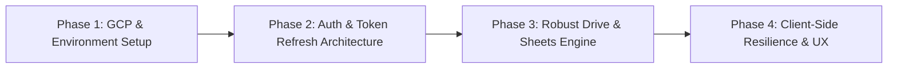

# Google Drive & Sheets Integration Plan

## 1. Overview & Architecture Context

**Gasket Case** is designed around a **zero-storage backend** model. Rather than maintaining a centralized database of user records, vehicle logs and maintenance timelines are stored directly within client-owned Google Sheets spreadsheets located inside the user's Google Drive.

While the foundation for this architecture is in place, connecting to Google Drive has not functioned properly since day one. This document outlines the technical audit findings, root causes, and a phased implementation roadmap to establish a reliable, production-ready pipeline.

---

## 2. Root Cause Analysis

### 2.1 GCP Console & Configuration Gaps
* **APIs Disabled by Default**: A newly created Google Cloud Platform (GCP) project does not enable the **Google Drive API** (`drive.googleapis.com`) or **Google Sheets API** (`sheets.googleapis.com`) by default. Calling these APIs without enabling them produces HTTP 403 `accessNotConfigured` errors.
* **Missing Environment Variables**: Running without a local `.env.local` causes NextAuth to fall back to hardcoded mock credentials (`'mock-client-id'`, `'mock-client-secret'`), which immediately aborts the OAuth handshake.
* **OAuth Consent & Test User Restrictions**: In GCP "Testing" mode, user accounts must be explicitly registered under **Test Users**, and `http://localhost:3000/api/auth/callback/google` must be configured under **Authorized Redirect URIs**.

### 2.2 NextAuth Token Expiration (1-Hour Access Token Window)
* In `app/api/auth/[...nextauth]/route.js`, the JWT callback stores `account.access_token` into the token:
  ```javascript
  async jwt({ token, account }) {
    if (account) {
      token.accessToken = account.access_token
    }
    return token
  }
  ```
* Google OAuth access tokens expire strictly after **3,600 seconds (1 hour)**.
* Even though `access_type: 'offline'` is requested, `account.refresh_token` and `account.expires_at` are discarded. After 60 minutes, the stored `accessToken` expires permanently, causing all subsequent Drive and Sheets API calls to fail with HTTP 401 `Invalid Credentials`.

### 2.3 Scope Semantics & File Discovery (`drive.file`)
* The app requests `https://www.googleapis.com/auth/drive.file` (excluding the sensitive `auth/spreadsheets` scope to adhere to least-privilege security).
* **Behavior of `drive.file`**: This scope grants access **only** to files created by the application's specific OAuth Client ID, or files explicitly chosen by the user via the Google Picker API. The Google Sheets API operates completely within `drive.file` for app-created spreadsheets.
* **Discovery Quirk**: Any spreadsheet created manually in Google Drive (even if named `GasketCase_...`) will **not** be returned by `drive.files.list`. The app can only see files it created itself.
* **Sharing Limitation**: When User A shares a file with User B (`action: 'share_vehicle'`), User B will not automatically see it in `drive.files.list` under `drive.file` scope unless selected via Google Picker or granted broader scope permissions.

### 2.4 Spreadsheet Creation & Locale Sensitivity
* In `POST /api/timeline`, vehicle spreadsheets are created using `drive.files.create` with MIME type `application/vnd.google-apps.spreadsheet`, followed by a `sheets.spreadsheets.values.update` against `Sheet1!A1:F1`.
* **Locale Fragility**: In non-English Google accounts, the default initial sheet title depends on the account language (e.g., `Feuille 1`, `Hoja 1`, `Tabellenblatt1`). Calling `Sheet1!A1:F1` fails with HTTP 400 `Unable to parse range`.
* **Proper API**: The Google Sheets API provides `sheets.spreadsheets.create`, which allows explicit naming of `Sheet1` and setting initial grid data and sheet metadata in a single atomic call.

### 2.5 Silent Frontend Error Handling
* In `app/page.js`, `fetchVehicles`, `fetchTimeline`, and `handleCreateVehicle` do not verify `res.ok` before processing JSON responses.
* If a server route returns an error (HTTP 401 or 500), the error message is swallowed, leaving the UI in an empty state or with dialogs that fail silently.
* In `app/api/timeline/route.js`, errors caught during sheet reading fallback silently to `{ data: { values: [] } }`, masking underlying auth and permission failures.

### 2.6 Route Handler Module Imports
* In Next.js App Router, `app/api/timeline/route.js` imports `authOptions` directly from `../auth/[...nextauth]/route.js`.
* Route handlers are endpoint entrypoints; importing across route files can trigger circular module evaluation and bundling issues in modern Next.js versions. Shared configurations should reside in dedicated modules (e.g., `lib/auth.js`).

---

## 3. Implementation Roadmap



> [!TIP]
> For the complete, start-to-finish operational guide covering Google Cloud Console configuration, OAuth 2.0 credentials, Vercel environment variables, custom domains, and end-to-end cooperation, see the [DevOps & Deployment Guide](devops-deployment-guide.md).

---

### Phase 1: Environment & Google Cloud Console Setup

> Detailed walkthrough available in [DevOps & Deployment Guide](devops-deployment-guide.md).

#### Objectives
1. Ensure the Google Cloud project is properly configured with required APIs, scopes, and redirect URIs.
2. Establish a standardized `.env.example` template in the codebase.

#### Action Items
- [x] Create `gasket-case/.env.example` with the following variables:
  ```env
  GOOGLE_CLIENT_ID="your-client-id.apps.googleusercontent.com"
  GOOGLE_CLIENT_SECRET="GOCSPX-your-client-secret"
  NEXTAUTH_SECRET="generate-with-openssl-rand-base64-32"
  NEXTAUTH_URL="http://localhost:3000"
  ```
- [x] Enable APIs in GCP Console:
  - Google Drive API (`drive.googleapis.com`)
  - Google Sheets API (`sheets.googleapis.com`)
- [x] In GCP *APIs & Services > Credentials*:
  - Add Authorized Redirect URI: `http://localhost:3000/api/auth/callback/google` and production `https://gasketcase.app/api/auth/callback/google`.
- [x] In GCP *OAuth Consent Screen*:
  - Add scopes: `.../auth/drive.file`, `openid`, `email`, `profile`.
  - Add developer/tester email addresses under **Test users**.

---

### Phase 2: NextAuth & Token Refresh Architecture

#### Objectives
1. Decouple `authOptions` into a shared module.
2. Implement silent token refresh so user sessions remain active beyond 1 hour.
3. Configure Google OAuth2 client instances with refresh credentials.

#### Action Items
- [x] **Extract Auth Options**:
  - Create `gasket-case/lib/auth.js` exporting `authOptions`.
  - Update `app/api/auth/[...nextauth]/route.js` to re-export the handler using `authOptions` from `lib/auth.js`.
  - Update `app/api/timeline/route.js` to import `authOptions` from `@/lib/auth`.
- [x] **Implement Token Refresh Callback in `lib/auth.js`**:
  - Preserve `account.refresh_token` and compute `token.expiresAt = Date.now() + account.expires_in * 1000`.
  - On subsequent calls to the `jwt` callback, if `Date.now() < token.expiresAt`, return the cached `token`.
  - If expired, execute a refresh grant request to Google OAuth token endpoint (`https://oauth2.googleapis.com/token`) to obtain a new `access_token` and update `token.expiresAt`.
  - Expose `session.accessToken` and `session.error` (e.g. `'RefreshAccessTokenError'`) to the client.
- [x] **Instantiate Authenticated Google Client**:
  - Update `getGoogleClients` to supply `clientId` and `clientSecret`:
    ```javascript
    function getGoogleClients(accessToken, refreshToken) {
      const oauth2Client = new google.auth.OAuth2(
        process.env.GOOGLE_CLIENT_ID,
        process.env.GOOGLE_CLIENT_SECRET
      )
      oauth2Client.setCredentials({
        access_token: accessToken,
        refresh_token: refreshToken,
      })
      return {
        drive: google.drive({ version: 'v3', auth: oauth2Client }),
        sheets: google.sheets({ version: 'v4', auth: oauth2Client }),
      }
    }
    ```

- [x] **Migrate Vehicle Creation**:
  - Replace `drive.files.create` in `POST /api/timeline` with `sheets.spreadsheets.create`:
    ```javascript
    const response = await sheets.spreadsheets.create({
      requestBody: {
        properties: {
          title: `GasketCase_${name}`,
        },
        sheets: [
          {
            properties: {
              title: 'Sheet1',
              gridProperties: { rowCount: 1000, columnCount: 10 },
            },
            data: [
              {
                startRow: 0,
                startColumn: 0,
                rowData: [
                  {
                    values: [
                      { userEnteredValue: { stringValue: 'ID' } },
                      { userEnteredValue: { stringValue: 'Date' } },
                      { userEnteredValue: { stringValue: 'Component' } },
                      { userEnteredValue: { stringValue: 'Odometer' } },
                      { userEnteredValue: { stringValue: 'Cost' } },
                      { userEnteredValue: { stringValue: 'Notes' } },
                    ],
                  },
                ],
              },
            ],
          },
        ],
      },
    })
    ```
- [x] **Dynamic Sheet Title Resolution**:
  - When fetching values in `GET /api/timeline`, inspect spreadsheet metadata or use the resolved sheet name if `Sheet1` is not present, avoiding hardcoded assumptions.
- [x] **Proper Error Propagation**:
  - Differentiate between 401 (unauthorized / session expired), 403 (permissions / API disabled), 404 (file missing / deleted in Drive), and 500. Return descriptive JSON bodies.
- [x] **Dedicated Drive Folder Organization & File Actions**:
  - Automatically isolate spreadsheets inside a dedicated `GasketCase/` Google Drive folder.
  - Implement maintenance record editing (`edit_log`), vehicle renaming (`rename_vehicle`), and safe deletion via Google Drive Trash (`delete_vehicle`).

---

### Phase 4: Client-Side Resilience & UX Improvements

#### Objectives
1. Provide immediate user feedback on connection, authentication, or network failures.
2. Handle token refresh failures by triggering re-authentication cleanly.

#### Action Items
- [ ] **Response Validation in `app/page.js`**:
  - Update `fetchVehicles`, `fetchTimeline`, and `handleCreateVehicle` to inspect `res.ok`.
  - On error response, parse `data.error` and display a user-facing notification (Snackbar / Alert).
- [ ] **Auth Expiration Detection**:
  - Monitor `session?.error === 'RefreshAccessTokenError'`. If detected, prompt the user to re-authenticate via `signIn('google')`.
- [ ] **Empty State Guidance**:
  - Enhance the dashboard empty state to offer a prominent "Create Your First Vehicle" call-to-action with clear status indicators during sheet creation.

---

## 4. Verification & Testing Checklist

| Test Case | Description | Expected Result |
| :--- | :--- | :--- |
| **Initial Login** | Sign in with a registered Google test account | Redirects to dashboard, retrieves vehicle list without 401/403 errors |
| **Vehicle Creation** | Create a new vehicle titled "2024 Honda Civic" | Creates spreadsheet with explicit `Sheet1` tab and headers; vehicle appears in dropdown |
| **Spreadsheet Inspection** | Check Google Drive directly | `GasketCase_2024 Honda Civic` exists in Drive root with populated header row |
| **Log Service Entry** | Add a maintenance log entry | Appends row to Sheet1 in Google Drive; timeline and analytics recalculate immediately |
| **Session Longevity** | Retain session past 60 minutes | Background token refresh triggers automatically; API calls continue working |
| **Error Handling** | Revoke app permissions in Google Account | Frontend detects 401/403 and prompts user to reconnect without crashing |
